<div align="center">


<br/>


<br/><br/>


</div>

---

## AI Interface / System Portal

<div align="center">



<br/>

[ **PROJECTS** ](#featured-projects) · [ **STACK** ](#tech-stack) · [ **STATS** ](#github-stats) · [ **CONNECT** ](#connect)

</div>

---

## Who I Am

```ts
const aayushman = {
  title: "AI/ML Engineer",
  stack: [
    "Python", "SQL", "PyTorch", "TensorFlow", "Keras", "Scikit-Learn",
    "XGBoost", "OpenCV", "FastAPI", "Docker", "Streamlit",
  ],
  launchedProjects: ["RansomwareWatch", "Thedu"],
  certifications: [
    "Generative AI — Great Learning",
    "Python — Udemy",
  ],
  status: "Open to work",
  openTo: [
    "Full-time roles worldwide",
    "Remote roles worldwide",
    "Freelance projects",
  ],
};
```

---

## Featured Projects

### RansomwareWatch

<a href="https://github.com/ayushmanbaruah-dev/ransomwarewatch">
  
</a>

End-to-end machine learning pipeline for ransomware detection on the CICIDS 2017 dataset, with WCGAN-GP synthetic data generation, an XGBoost classifier and SHAP-based explanations.

| Layer | Technology |
| ----- | ---------- |
| Dataset | CICIDS 2017 |
| Synthetic data | WCGAN-GP (PyTorch) |
| Classifier | XGBoost |
| Explainability | SHAP |
| Interface | Streamlit |
| Packaging | Docker |

**Code** → [github.com/ayushmanbaruah-dev/ransomwarewatch](https://github.com/ayushmanbaruah-dev/ransomwarewatch)

### Thedu

<a href="https://github.com/ayushmanbaruah-dev/THEDU">
  
</a>

Lightweight, relevance-first local search engine with deterministic tokenization, an inverted index and BM25 ranking, exposed through a REST API and a CLI.

| Layer | Technology |
| ----- | ---------- |
| Ranking | BM25 |
| Indexing | Inverted index |
| Storage | SQLite |
| API | FastAPI, REST API, CLI |
| Delivery | Docker, CI/CD |
| Quality | Automated testing |

**Code** → [github.com/ayushmanbaruah-dev/THEDU](https://github.com/ayushmanbaruah-dev/THEDU)

---

## Tech Stack

**Languages**


**Frontend**


**Backend / Infrastructure**


**AI / Database**


**Dev Tools**


Also working with: `SQL` `Keras` `XGBoost` `SHAP` `Streamlit` `CI/CD` `MERN`

---

## GitHub Stats

<div align="center">


<br/><br/>


<br/><br/>


<br/><br/>


</div>

---

## Connect

Open to full-time roles, remote roles and freelance work, anywhere in the world. For freelance enquiries, email is the best route.

<div align="center">

<a href="https://www.linkedin.com/in/aayushmaanbaruah/"></a>
<a href="mailto:aayushmanbaruah@aol.com"></a>
<a href="https://github.com/ayushmanbaruah-dev"></a>

</div>


